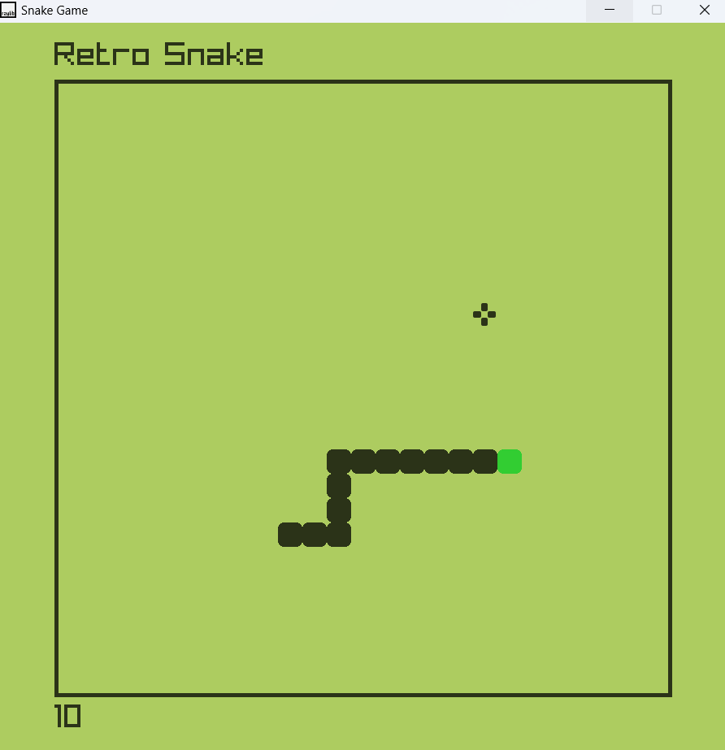

## Table of Contents

- [Usage](#usage)
- [Game Mechanics](#game-mechanics)
- [Screenshot](#screenshot)

## Usage

- **Controls**:  
  - **Arrow keys** to move the snake (Up, Down, Left, Right).
  - **Enter** to pause/resume the game.
  - The snake cannot reverse its direction (e.g., you cannot move up if the snake is moving down).
  
- **Objective**:  
  The goal of the game is to eat the food, which will cause the snake to grow longer. Avoid hitting the walls or the snake’s own tail, as doing so will end the game.

## Game Mechanics

- The snake is initially placed at a starting position and moves in a defined direction (right).
- The snake grows by one segment each time it eats food.
- Food spawns randomly on the grid.
- When the snake collides with the wall or its own tail, the game ends, and the snake resets to the starting position.

### Key Components:

1. **Snake Class (`snake.hpp`, `snake.cpp`)**:
   - Handles the snake's body, movement, and growth.
   - Checks for boundary collisions and self-collisions.
   - Allows direction updates and prevents reverse movement.
   
2. **Food Class (`food.hpp`, `food.cpp`)**:
   - Handles the food's appearance and position.
   - Spawns food randomly within the grid.
   - Draws the food texture on the screen.

3. **Game Class (`game.hpp`, `game.cpp`)**:
   - Manages game initialization, updates, and input handling.
   - Tracks score and handles game-over conditions.

4. **Graphics & Sounds**:
   - Uses `raylib` for rendering the snake, food, and game screen.
   - Plays sounds for when the snake eats food or hits a wall.

### Game Flow:
1. The game initializes the snake and food.
2. The player controls the snake using the arrow keys.
3. When the snake eats food, it grows in size.
4. If the snake collides with the wall or its own body, the game ends.
5. The player can toggle the game’s running state with the `Enter` key.

## Screenshot

---

Enjoy playing Snake!